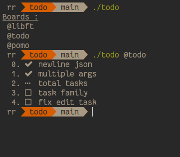

<h1 align="center">todo</h1>
<h4 align="center">Simple todo app in cli for unix users !</h4>
<div align="center"></div>

## Table of content

- [Description](#description)
- [Setup](#setup)
- [Usage](#usage)
- [License](#license)

# Description

This project is a fork of [Taskbook](https://github.com/klaudiosinani/taskbook)
written in Golang, the approach is more minimal only 5 flags (a to e) and no
additionnal infos like priority, star, notes, date etc. This simple version is
straight to the point you have a boards of projects and each one contains tasks
with their status, all this data is stored in a json format locally in your
home directory (~/.todo.json).

# Setup

1. Install Golang if you don't have it : [Install Go](https://go.dev/doc/install)
2. Clone this repo : 
```bash 
git clone github.com/RyRch/todo
```
3. Go to the directory : 
```bash 
cd todo 
```
4. Build and install it with : 
```bash
sudo make install
 ```

# Usage

## Board view

Invoking todo without any options will display a board of your projects.

```bash
todo
```

## Project view

To display the tasks of a specific project you need to specify the name with '@'.

```bash
todo @project
```

## Add a Project

To add a new project your need to use the flag '-a' and the name in parenthesis.

```bash
todo -a "project_1"
```

## Delete a Project

To delete a project you need to use the flag '-d' and the name with '@'.

```bash
todo -d @project_1
```

## Edit a Project name

To edit a project name you need to use the flag '-e', new project name in
parenthesis and the old project name with '@'.

```bash
todo -e "toto" @gogo
```

## Add a Task

To add a task you need to use the flag '-a' with the task name in parenthesis
and the project name.

```bash
todo -a "send email" @work
```

## Change Task status

In order to change the status of a particular task you need to specify the
action, the ID of the task and the project related. 

1. flag '-b' for begin

 ```bash
 todo -b 0 1 @project
 ```
2. flag '-c' for check

 ```bash
todo -c 1 2 @project
```
3. flag '-d' for delete

```bash
 todo -d 0 1 2 @project
 ```

## Edit a Task name

To edit a task name is quite like [Editing a Project name](##Edit a Project name)
but you need to specify the ID of the task.

```bash
todo -e 0 "test app" @popo
```

# License

[MIT](https://github.com/RyRch/todo/blob/main/LICENSE.md)
